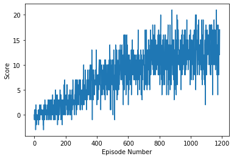

# Report 
## Payam Mousavi

The original Deep Q-Learning (DQN) algorithm was sufficient to solve this problem. The neural network architecture
used is as follows:
- Dense (Fully connected) layer 1:
    - Input: 37 (state size)
    - Output: 64
- Dense layer  2:
    - Input: 64
    - Output: 64
- Dense layer 3:
    - Input: 64
    - Output: 4 (action size)

The following hyperparameters were used for the DQN algorithm:
- Max. Steps/episode: 1000
- Starting eps: 1.0
- Ending eps: 0.02
- eps decay rate: 0.998

## Training results
The following plot shows the training results. The average score is shown as a function of episode number.
The environment is solved in 1086 episodes with an average score of 13.00 (as required). The model was trained 
on my local GPU (NVIDIA GTX-1080) on Ubuntu 16.04, and the training took approximately 684 seconds. 

In the testing mode, the average score obtained (after 100 episodes) was 14.68

## Potential future work
- More thorough hyperparameter optimization. I did a few quick tests to settle on the current values, but the results 
appeared sensitive to the parameters. I expect improvements can be made by a more thorough search.
- As suggested in the project description, learning from pixels is a good avenue to explore
- More advanced algorithms could be tried: 1) RAINBOW or 2) Double-DQN